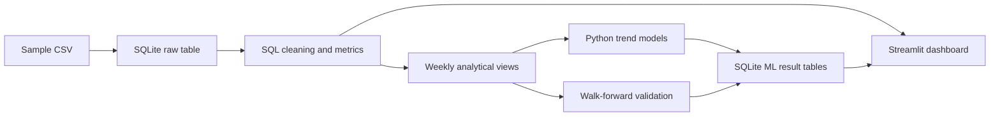

# Gymdata

This is a data-analysis pipeline that generates valuable insights about the progress evolution of strength training exercises using SQL, Machine Learning and visualisation tools. 
The user provides a .csv file containing chronological logs of workout sessions and the application performs an SQL + Machine Learning analysis pipeline, displaying trends about personal gym data. 

This is an active personal learning project, inspired by a passion for Data Science and curiosity about how to implement its tools to improve my gym habits. The outputs should be interpreted as exploratory analytics rather than training, medical, or injury-prevention advice.


# Project status
The current version is a learning version and implements an end-to-end analytics pipeline for personal gym data:

* CSV ingestion into SQLite
* SQL-based cleaning and feature engineering
* weekly exercise and training-volume analysis
* recent-versus-historical progression metrics
* an interactive Streamlit dashboard
* per-exercise linear trend models
* walk-forward forecast validation
* comparison against a no-change baseline

The forecasting component predicts the next recorded weekly estimated 1RM, rather than performance in the next calendar week. Results are evaluated using mean absolute error and compared with a persistence baseline that assumes the next performance value will equal the current value.

## Features 

### Exercise progression

For each gym exercise, the application computes 

* Weekly training volume
* Weekly best estimated 1 Rep Max (1RM)
* All-time best estimated 1RM
* Recent best performance
* Percentage of all-time best
* Recent linear trend slope
* Projected next recorded performance

### Forecast validation
The forecasting model is evaluated using walk-forward validation.

At every validation step:

1. The model is trained only on previous observations.
2. It predicts the next recorded weekly performance.
3. The prediction is compared with the actual result.
4. Its error is compared with a no-change baseline.

The no-change baseline assumes: ```next performance = current performance```. Mean absolute error is used as the main evaluation metric.

### Dashboard
* The Streamlit dashboard includes:
* Exercise progression charts
* Weekly estimated 1RM trends
* Recent-versus-historical performance rankings
* Recent trend scores
* Forecast validation results
* Model-versus-baseline comparisons

## SQL layer

SQL is used to create the analytical data model. The main database objects include:

| Object | Purpose | 
|---|---| 
| `workouts` | Raw imported workout data |
| `cleaned_workouts` | Cleaned and typed workout records | | `set_metrics` | Set-level volume and estimated 1RM | 
| `exercise_summary` | Historical exercise summaries | 
| `exercise_weekly` | Weekly exercise-level metrics |
| `exercise_progress` | Recent-versus-historical comparison |
| `workout_summary` | Session-level dashboard metrics | 

The SQL scripts are executed in numerical order during the database build.

## Machine-Learning approach 

The preliminary model fits a separate linear regression for each exercise. The model uses the most recent recorded weekly estimated 1RM observations: ```text weekly estimated 1RM = intercept + slope × observation index ``` .

The slope is used as a recent progression indicator: 

- Positive slope: recent improvement
- Near-zero slope: relatively flat performance
- Negative slope: recent decline

The projected next value is an experimental trend extrapolation. It does not account for programming changes, deloads, illness, exercise substitutions, or other external factors. 

## Validation results 

The model is compared with a persistence baseline using walk-forward validation. In my personal data: 

| Method | Mean absolute error |
|---|---:|
| Linear trend model | `4.26 kg` | 
| No-change baseline | `3.16 kg` | 

Additional validation information should include: 

- Number of exercises evaluated
- Number of historical predictions
- Model window size
- Minimum observations required
-  Exercises where the model beat the baseline.

A model that does not beat the baseline can still provide useful descriptive trend information.

## Setup 

### Requirements 
- Python 3
- SQLite
- pip

1. Clone the repository: ```bash git clone https://github.com/YOUR_USERNAME/gymdata.git cd gymdata ```
2. Create and activate a virtual environment: ```bash python3 -m venv .venv source .venv/bin/activate ```
3. Install dependencies: ```bash pip install -r requirements.txt ```

## Usage 
1. Run the complete pipeline using the sample dataset: ```bash python src/run_pipeline.py \ --input data/sample_gym.csv \ --database data/gym.db ```
2. Start the Streamlit dashboard: ```bash streamlit run app/app.py -- \ --database data/gym.db ```

Streamlit will print the local dashboard address in the terminal. To use another CSV file: ```bash python src/run_pipeline.py \ --input "/path/to/workout_data.csv" \ --database data/gym.db ``` 

The input CSV is expected to contain columns similar to: 

```
Date
Duration
Exercise Name
Set Order
Weight
Reps
```


## Architecture




## Limitations 

The current version has several limitations:

- Estimated 1RM is an approximation rather than a measured maximum.
- The model predicts the next recorded observation, not a fixed calendar week.
- Training gaps are not yet represented directly in the trend model.
- A separate model is trained for each exercise.
- Small exercise histories may not contain enough observations for modeling.
- The linear model assumes recent progress can be approximated by a straight line.
- Workout programming, fatigue, sleep, nutrition, and exercise technique are not modeled.
- Results depend on the consistency and quality of the source data.

## Roadmap Planned improvements include:

- Improved handling of missing values
- Automated tests for SQL and Python transformations
- Session-level anomaly detection
- Calendar-aware time features
- RPE and training-volume forecasting features
- Regularized regression models
- Comparison with tree-based models
- Improved dashboard navigation and filters
- Optional natural-language summaries of analytical results
- Public Streamlit deployment

## Disclaimer 

My original personal workout dataset is not included in this repository. However, the demonstrative gif is indeed based on my personal gym data. The included sample data is synthetic. 


